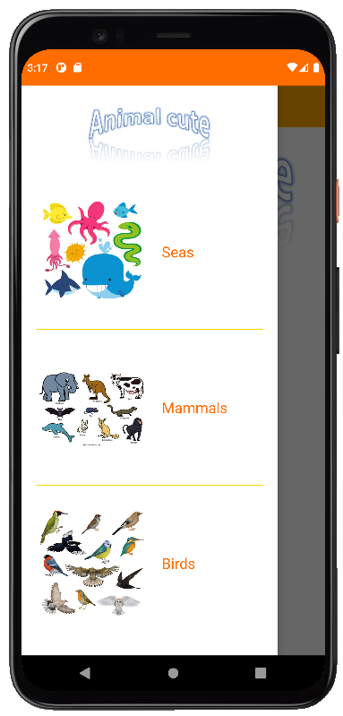
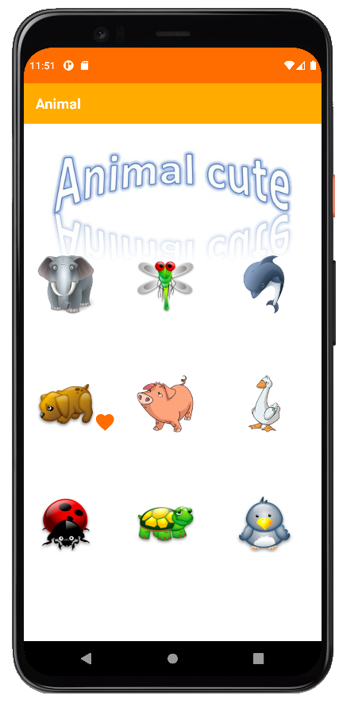
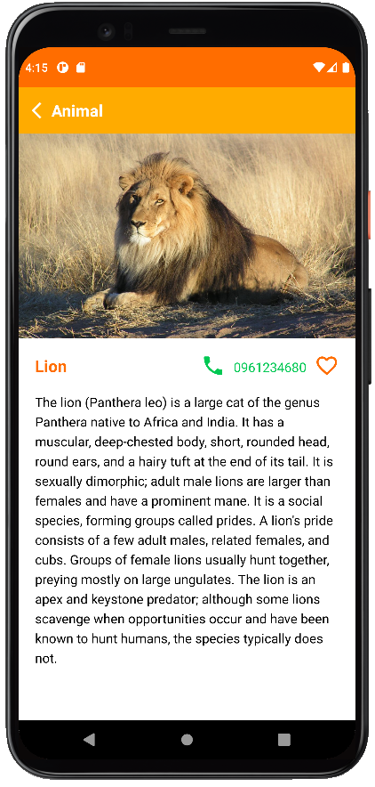

# prm391x_03-a_vn-java-android-animal-app

 This folder contains my submission to the assignment 3 `Animal Mobile App` for a simple e-newspaper in the course PRM391x_3-A_VN (Mobile Application Programming), a part of the path Software Engineering provided by FUNiX.

## About the project
The app should at least have 3 Screens with some following features:
- _**Screen 1**_: a drawer list 3 branches of animals. On clicking one of three branches, Screen 2 will appear and be filled with animals belonging to the clicked branch.
- **_Screen 2_**: list all animals available
  - On clicking into an icon of animal on Screen 2, Screen 3 will appear with the respective information.
- **_Screen 3_**: details of animal which is previously clicked in Screen 2
  - Can swipe left or right to move backwards or forwards to the next animal.
  - On clicking the favorite icon (the heart icon), the icon of the animal in screen 1 will be favorited with a small heart below the icon. MAKE SURE when closing and reopen app, favorite animals still is remembered.
  - Save a phone number for animals so that the icon of the animal will appear when receiving a call from saved phone number.

|  |  |      |
| :-------------| :------------- | :------------- |
| Screen 1      | Screen 2    | Screen 3       |

## Demo

The demo video can be seen via: https://youtu.be/PcYNGVL3-wk

## Further enhancement
- Adjust user interface for better interaction
- Use database to store and load assets (or resources) for mobile app
